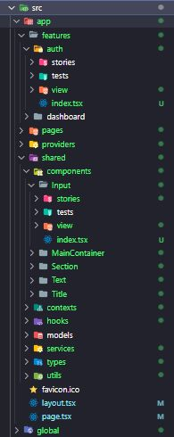

<h1 align="center">Portal Administração</h1>

<details open="open">
  <summary>Sumário</summary>
  <ol>
    <li><a href="#Tecnologias">Tecnologias</a></li>
    <li><a href="#Formulários">Formulários</a></li>
    <li><a href="#Ícones">Ícones</a></li>
    <li><a href="#Testes">Testes</a></li>
    <li><a href="#Arquitetura">Arquitetura</a></li>
    <li><a href="#Padronização de código">Padronização de código</a></li>
    <li><a href="#Inicialização">Inicialização</a></li>
  </ol>
</details>

## Tecnologias

Tecnologias no Escopo da aplicação
* NextJs
* React
* TypeScript
* Tailwindcss
* Jest
* Eslint e Prettier
* Axios
* Firebase Analytics

## Formulários

* React Hooks Forms
* Zod

## Ícones

* React Icons
## Testes

* Jest
* Testing Library

 - Preferencialmente testar de 70% a 100% do covarage
 - Componentes que não incluem lógica não há real necessidade de testes
 - Dado o uso do Prettier 3+, toMatchInlineSnapshot não é compatível, usar apenas toMatchSnapshot

## Arquitetura



## Padronização de código

- **Geral**
    - Stories devem ser finalizados com .ts
    - Componentes devem ser finalizados com .tsx
    - Estrutura de componentes devem seguir Composition Pattern sempre que possível
    - Componentes reutilizáveis devem ser alocados em ~shared
    - Funções utilitárias devem estar em arquivos separados, p.ex.: MyComponentUtils.ts
    - Index devem exportar o objeto de acordo com Composition Pattern
    - Formulários devem respeitar o padrão e ser criados schemas
    - Toda a regra de UX deve estar dentro de Tailwind.config.ts
    - Toda estilização deve ser feita com Tailwind Variants
    - Toda estilização deve estar em arquivos separados, p.ex.: MyComponentTV.ts

## Inicialização

1. Instale as dependências com Yarn
   ```sh
   yarn
   ```
1. Iniciar em Desenvolvimento
    ```sh
    yarn dev
    ```
2. Iniciar em Produção
    build
   ```sh
   yarn build
   ```
   Após o build
   ```sh
   yarn start
   ```
